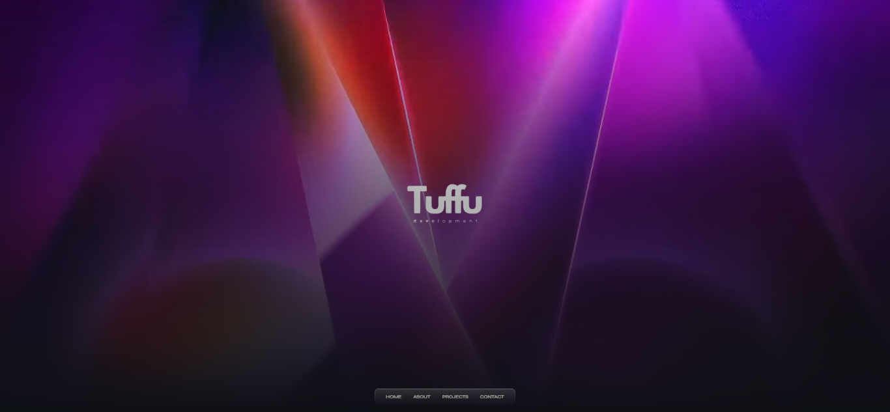
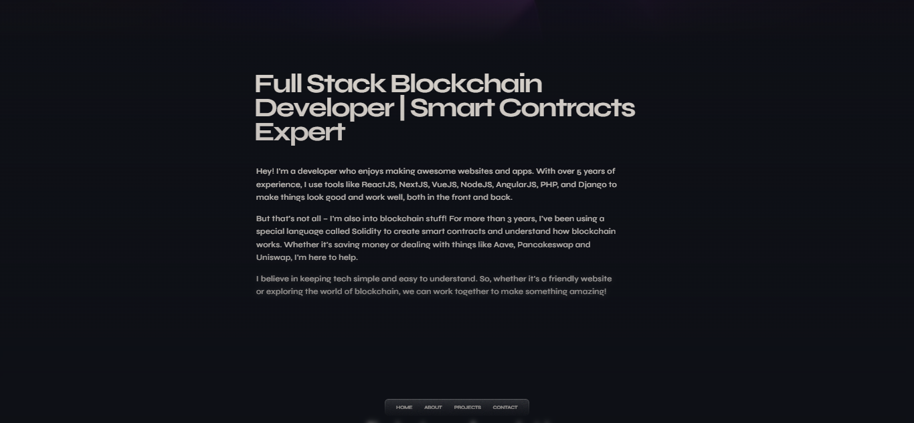
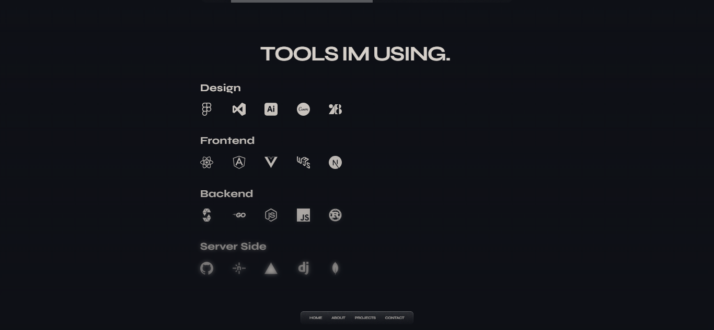
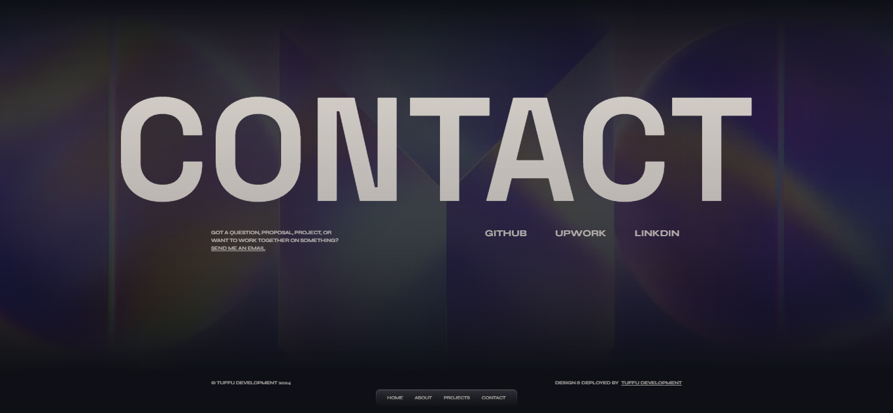

# Tuffu Development - My Personal Portfolio  

It's my first portfolio website, crafted using Next.js, React, and Tailwind CSS.

It serves as my portfolio.

Check it out [here](https://tuffudevelopment.vercel.app/)
 
---

## Showcase

<div>
    
    <br>
    
    <br>
    
      <br>
    
</div>

---

## Prerequisites

- [Node.js](https://nodejs.org/en/) - 20.4.0+ or [Bun](https://bun.sh/) - 0.7.0+
- That's it!

---

## Building

1. Clone the repository

    ```bash
    git clone https://github.com/TufailKhanDeveloper/tuffudevelopment.vercel.app/
    ```

2. Install dependencies

    ```bash
    bun install
    ```

3. Run the development server

    ```bash
    bun run dev
    ```

---

## Deployment 📦

Now you'll only need to deploy the app to your favorite hosting provider.
Personally I'd recommend [Vercel](https://vercel.com/) or [Netlify](https://www.netlify.com/).

1. Build the app

    ```bash
    bun run build
    ```

2. Start the production server

    ```bash
    bun run start
    ```

---

## Tech used 🛠️

- [Next.js](https://nextjs.org/) - Bundler
- [React](https://reactjs.org/) - UI Library
- [Tailwind CSS](https://tailwindcss.com/) - CSS Framework
- [Framer Motion](https://www.framer.com/motion/) - Animation Library
- [GSAP](https://greensock.com/gsap/) - Animation Library
- [Bun](https://bun.sh/) - Task Runner
- [ESLint](https://eslint.org/) - Linter
- [Prettier](https://prettier.io/) - Code Formatter
- [Blobity](https://blobity.dev/) - Cursor Effects
- [usehooks-ts](https://usehooks-ts.com/) - Custom React Hooks

---

## License 📄

This project is licensed under the GNU GPLv3 License - see the [LICENSE](LICENSE) file for details.

---

## Goodbye 👋

If you liked this project, please consider giving it a ⭐!
